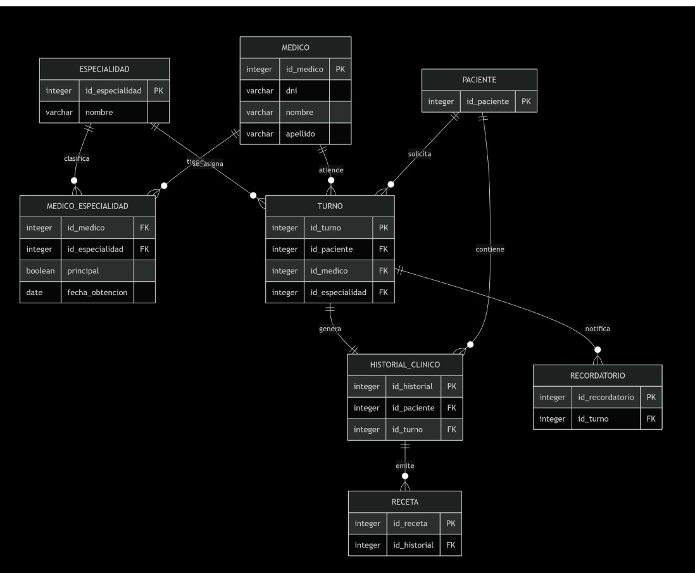

<h1 align="center">🩺 Turnero Médico – Grupo 23 (UTN-FRC)</h1>

<p align="center">
  
  
  
  
</p>

---

## 🎯 Objetivo del Proyecto
Desarrollar una aplicación que **optimice la gestión de turnos médicos** permitiendo registrar pacientes, médicos y especialidades, garantizando la **asignación eficiente y sin superposiciones**.  
Además, el sistema proporciona **herramientas de seguimiento clínico** como historial médico, emisión de recetas y reportes estadísticos de la actividad asistencial.

---

## 🧩 Alcance Funcional

✅ **Gestión de Pacientes, Médicos y Especialidades**  
✅ **Administración de turnos** con validación de disponibilidad horaria y control de superposición  
✅ **Registro de historia clínica** y **recetas electrónicas**  
✅ **Reportes** de turnos por médico y especialidad  
✅ **Estadísticas de asistencia** (atendidos vs. ausentes)  
💌 **Notificaciones automáticas por correo electrónico (opcional)**

---

## 🗄️ Diagrama Entidad–Relación (DER)
<p align="center">
  
</p>

---

## ⚙️ Tecnologías Utilizadas

| Tecnología | Descripción |
|-------------|-------------|
| 🐍 **Python** | Lenguaje principal de desarrollo |
| 🌐 **Flask** | Framework web utilizado para la aplicación |
| 💾 **SQLite3** | Base de datos relacional ligera |
| 🧪 **Pytest** | Pruebas unitarias y de integración |
| 🖥️ **HTML / CSS / Bootstrap** | Interfaz de usuario |

---

## 🚀 Cómo ejecutar el proyecto

```bash
# 1️⃣ Clonar el repositorio
git clone https://github.com/tuusuario/turnero-medico.git
cd turnero-medico

# 2️⃣ Instalar dependencias
pip install -r requirements.txt

# 3️⃣ Inicializar la base de datos
flask --app app init-db

# 4️⃣ Ejecutar la aplicación
flask --app app --debug run
